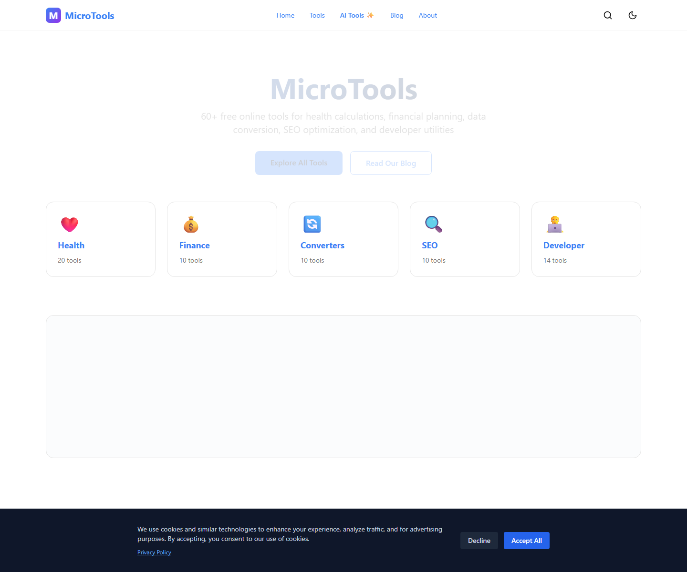
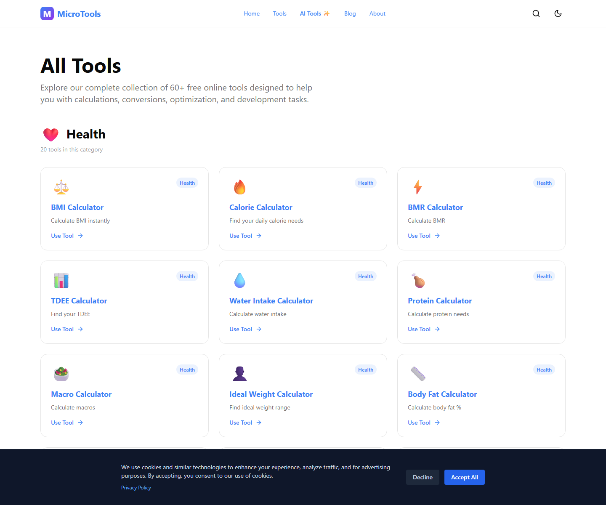
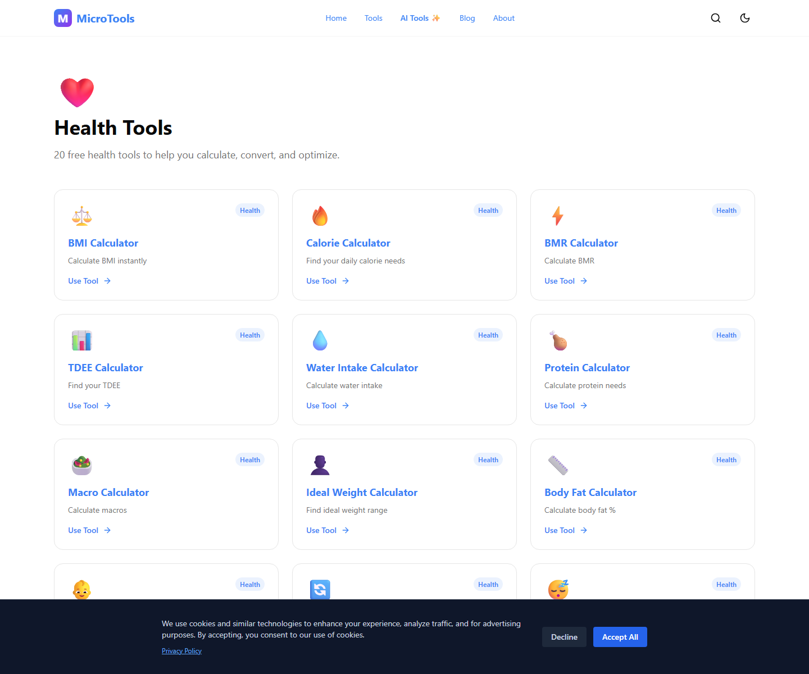
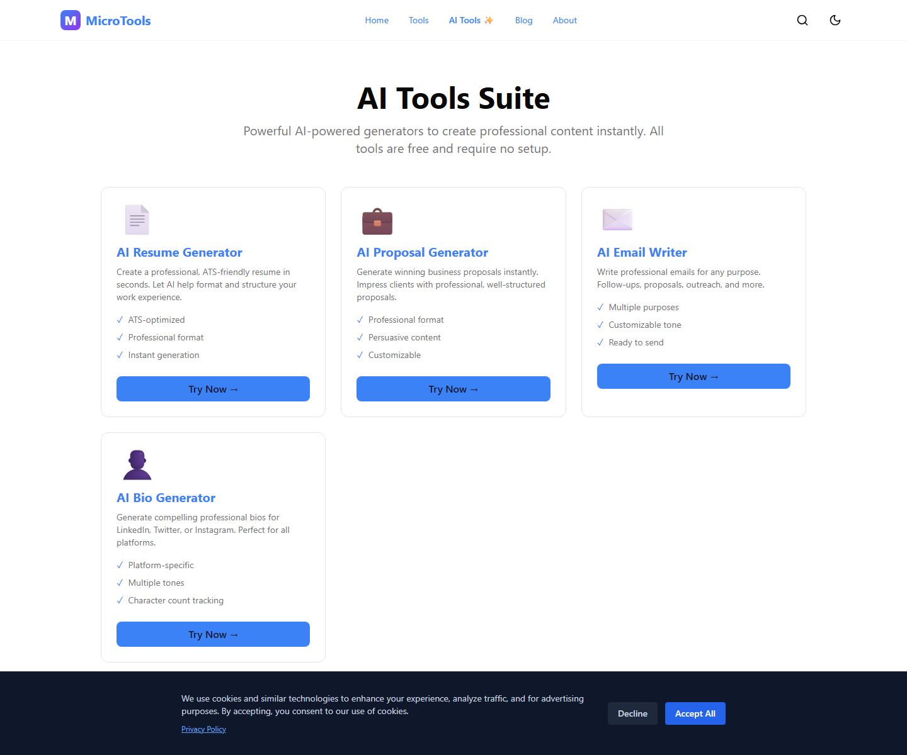
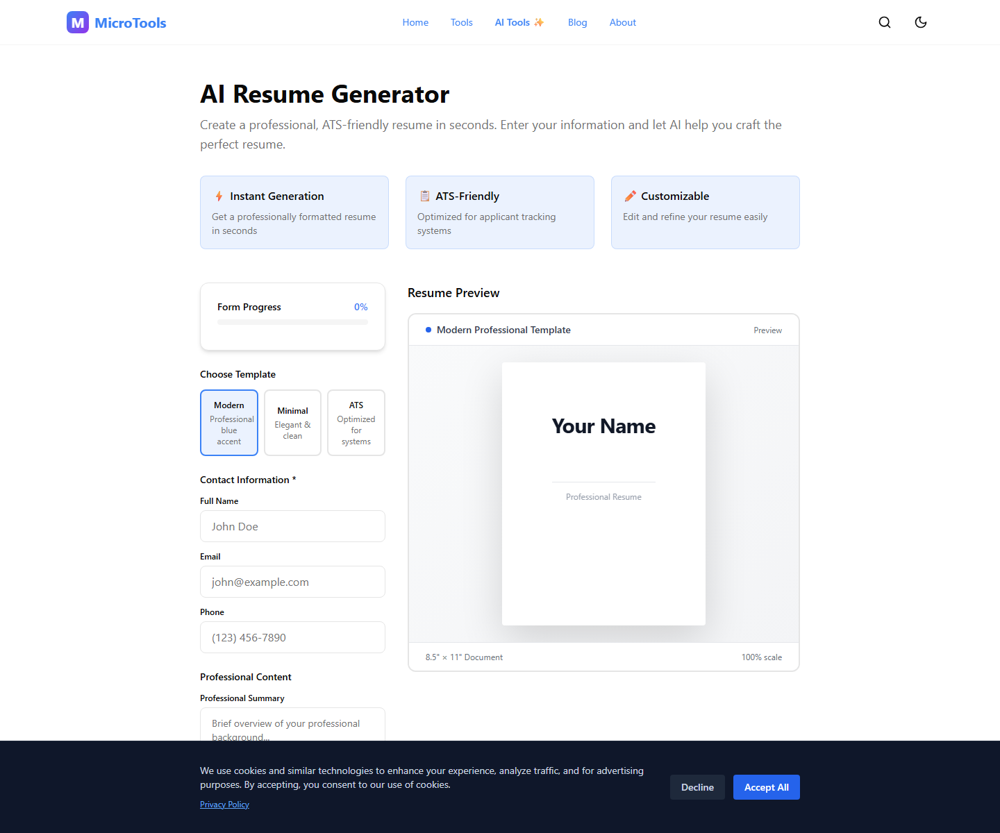

# MicroTools Platform

MicroTools Platform is a Next.js tools website with category landing pages, AI-assisted writing tools, blog content, analytics hooks, and utility calculators. The tracked codebase includes both general tool pages and a dedicated AI tools section.

## Current status

- Repository state: runnable web app
- Product focus: general utility platform with health, finance, converter, SEO, developer, and AI tools
- Build status from this audit: Passed (`npm run build`)
- Screenshot status: Real screenshots added from the running app

## Verified features from code

- Home page and category navigation
- Tool listing and dynamic category pages
- Dynamic tool detail pages
- AI tools landing page
- AI resume generator, bio generator, email writer, and proposal generator pages
- Blog index and article pages
- API routes for AI generation, explanation, and geo handling
- Analytics, cookie consent, and ad components

## Interface preview

### Home page



### Tools directory



### Health tools



### AI tools



### Resume generator



## Tech stack

- Next.js 15
- React 18
- TypeScript
- Tailwind CSS
- Markdown blog content
- Utility calculation libraries in `lib/calculations`

## Setup

```powershell
npm install
Copy-Item .env.example .env.local
npm run build
npm run start -- --hostname 127.0.0.1 --port 3000
```

## Testing

See [TESTING_GUIDE.md](./TESTING_GUIDE.md).

## Known limitations

- AI features need real API keys for full end-to-end generation testing
- The current home-page screenshot shows the cookie banner because that is the real first-visit UI state
- Next.js warned about an inferred workspace root because multiple lockfiles exist higher on disk

## Roadmap

- Add automated tests for tool calculation outputs and API routes
- Document expected environment variables for each AI feature more explicitly
- Capture additional screenshots for blog and individual calculator pages

## Repo docs

- [PROJECT_SUMMARY.md](./PROJECT_SUMMARY.md)
- [REAL_STATS.md](./REAL_STATS.md)
- [TESTING_GUIDE.md](./TESTING_GUIDE.md)
